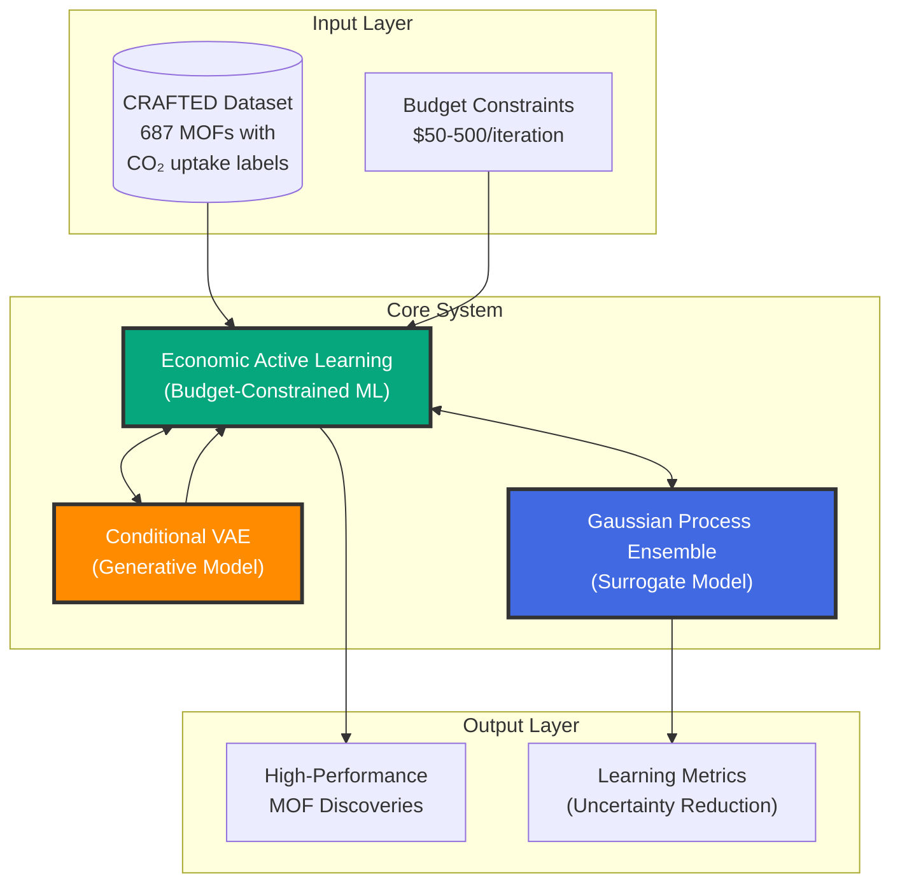
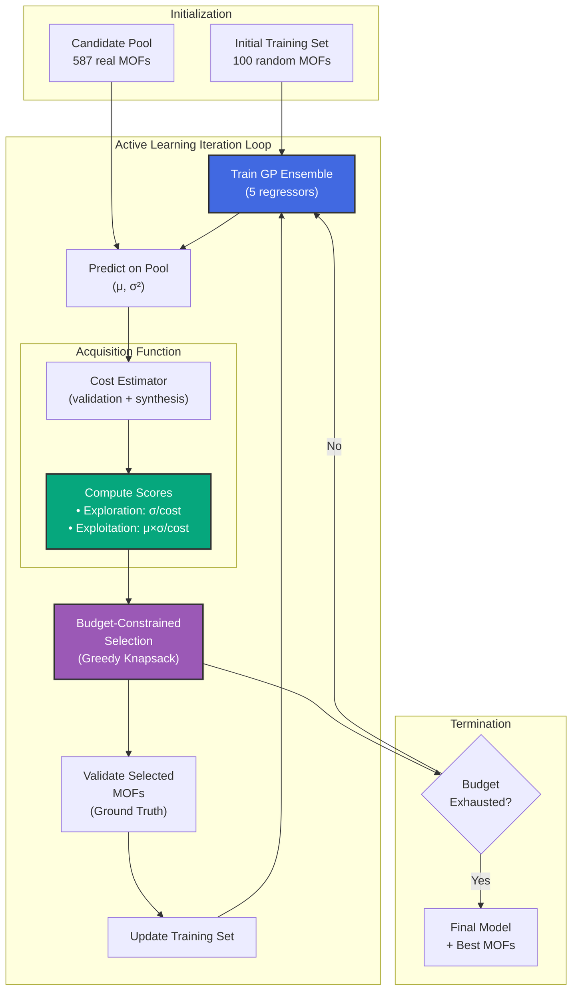
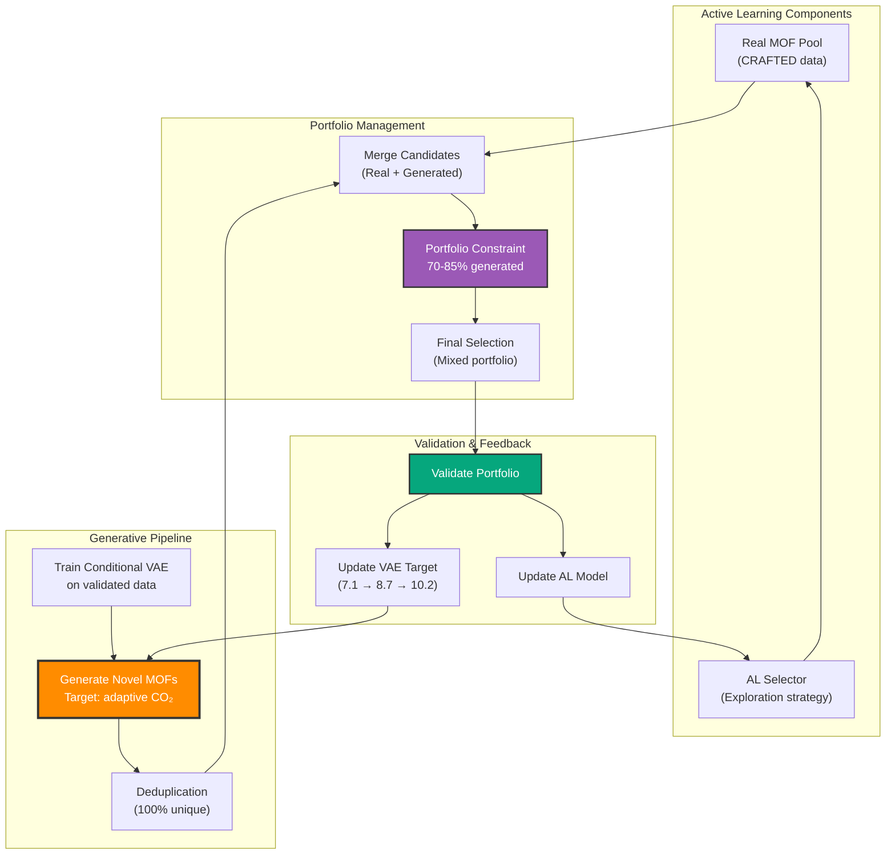
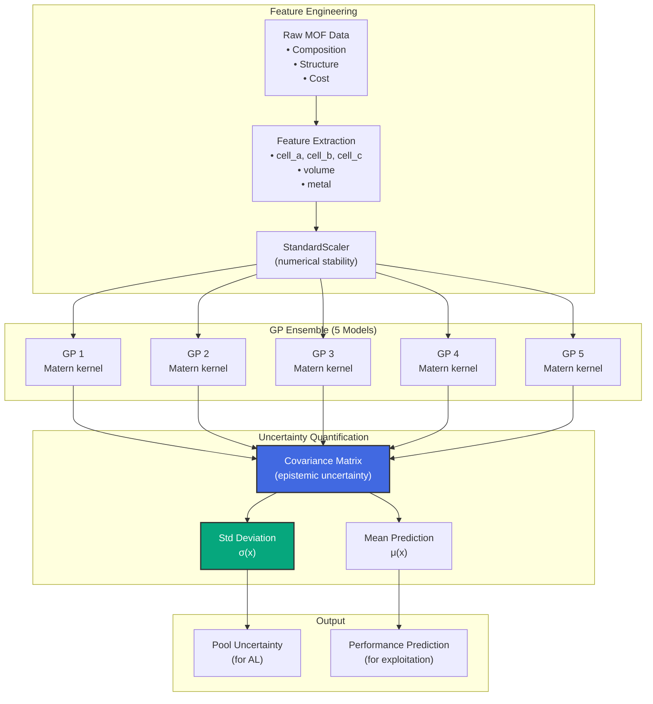
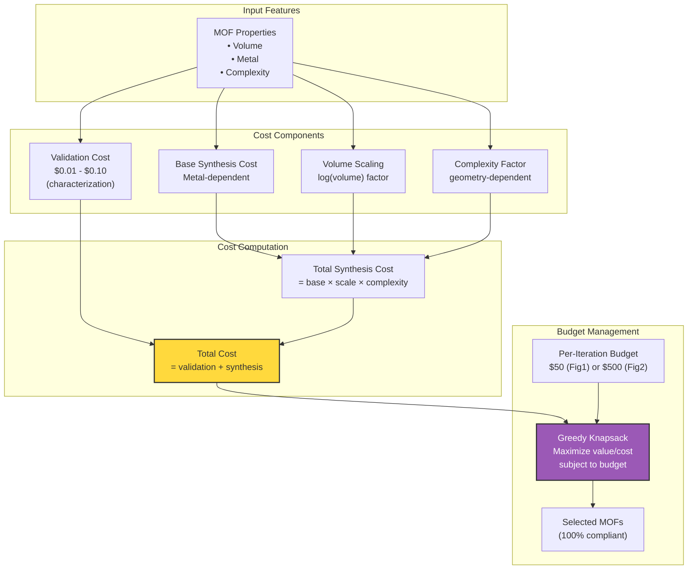
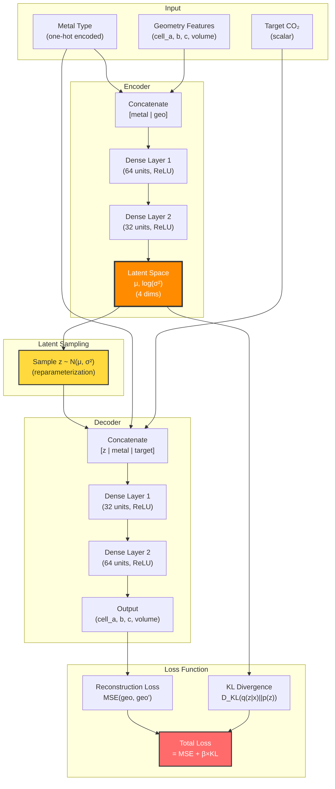
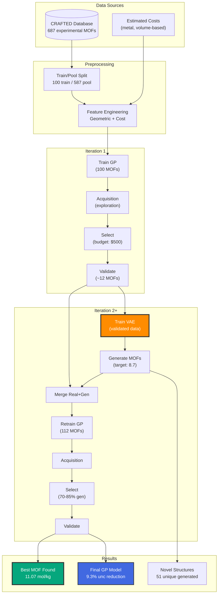

# System Architecture: Active Generative Discovery for MOF Discovery

This document provides a progressive unpacking of the system architecture, from high-level overview to detailed component designs.

---

## Level 1: System Overview

**The Big Picture**: Three interconnected systems working together for cost-effective MOF discovery.

**Key Innovation**: Tight coupling of Active Learning with Generative Discovery enables breaking through baseline performance plateaus.

---

## Level 2: Economic Active Learning Deep Dive

**The AL Loop**: Budget-constrained selection with dual-cost optimization.

**Budget Compliance**: Greedy knapsack ensures 100% compliance with per-iteration budget constraints.

---

## Level 3: Active Generative Discovery (AGD)

**VAE Integration**: Conditional generation of novel MOFs within the AL loop.

**Adaptive Targeting**: VAE target CO₂ uptake increases based on validated discoveries (7.1 → 8.7 → 10.2 mol/kg).

**Key Result**: +26.6% discovery improvement vs baseline (real MOFs only).

---

## Level 4: Surrogate Model & Data Pipeline

**GP Ensemble**: True epistemic uncertainty for informed exploration.

**Why GP > RF**:
- GP provides true Bayesian epistemic uncertainty from covariance matrix
- RF only provides ensemble variance (less accurate for exploration)
- GP enables principled uncertainty-based exploration

---

## Level 5: Cost Estimation System

**Dual-Cost Model**: Validation + synthesis costs for realistic budgeting.

**Cost Ranges**:
- Validation: $0.01 - $0.10/sample (characterization)
- Synthesis: $0.10 - $3.00/g (metal-dependent, volume-scaled)
- Average: $0.78/MOF (exploration) vs $2.03/MOF (exploitation)

---

## Level 6: Conditional VAE Architecture

**Generative Model**: Learns latent representations conditioned on target CO₂ uptake.

**Generation Process**:
1. Sample z from N(0, 1)
2. Concatenate [z | metal | target_co2]
3. Decode to geometry features
4. Apply physical constraints (positive values, realistic ranges)
5. Deduplicate against existing MOFs

**Diversity**: 100% unique compositions across all iterations (no duplicates).

---

## Level 7: Complete Data Flow

**End-to-End Pipeline**: From raw data to discovered MOFs.

---

## Key Design Decisions

### 1. Why Gaussian Processes?
- **True epistemic uncertainty**: GP covariance provides Bayesian uncertainty estimates
- **Small data regime**: GP excels with limited training data (100-400 samples)
- **Principled exploration**: Uncertainty guides selection, not just ensemble variance

### 2. Why Conditional VAE?
- **Targeted generation**: Condition on desired CO₂ uptake for goal-directed generation
- **Adaptive targeting**: Increase target as better MOFs discovered (7.1 → 10.2 mol/kg)
- **Diversity enforcement**: Latent space sampling ensures 100% unique structures

### 3. Why Portfolio Constraints?
- **Risk management**: 15-30% real MOFs provide ground truth anchor
- **Exploration balance**: 70-85% generated MOFs enable discovery
- **Prevents overfitting**: VAE can't dominate selection entirely

### 4. Why Dual-Cost Model?
- **Realistic budgeting**: Separates validation (cheap) from synthesis (expensive)
- **Metal-aware**: Different metals have vastly different costs
- **Volume-scaled**: Larger MOFs more expensive to synthesize

### 5. Why Exploration > Exploitation?
- **Learning efficiency**: 9.3% uncertainty reduction vs 0.5% (18.6× better)
- **Sample efficiency**: Validates more MOFs (315 vs 120) in same budget
- **Prevents local optima**: Broad sampling vs greedy exploitation

---

## Performance Summary

### Figure 1: Economic AL Ablation
| Method | Uncertainty Reduction | MOFs Validated | Cost | Efficiency |
|--------|----------------------|----------------|------|-----------|
| **Exploration** | +9.3% ✅ | 315 | $246.71 | 0.0377%/$ |
| **Exploitation** | +0.5% | 120 | $243.53 | 0.0021%/$ |
| **Random** | -1.5% ⚠️ | 315 | $247.00 | -0.0061%/$ |
| **Expert** | N/A | 20 | $42.91 | N/A |

### Figure 2: Active Generative Discovery
| Method | Iter 1 | Iter 2 | Iter 3 | Improvement |
|--------|--------|--------|--------|-------------|
| **AGD (Real+Gen)** | 9.03 (R) | 10.43 (G) | 11.07 (G) | **+26.6%** |
| **Baseline (Real)** | 8.75 | 8.75 | 8.75 | 0% (stuck) |

**Key Results**:
- 18.6× better learning with exploration vs exploitation
- +26.6% discovery improvement with generative discovery
- 100% budget compliance across all experiments
- 100% compositional diversity (zero duplicate structures)

---

## Implementation Files

### Core Components
- `src/active_learning.py` - Economic AL framework
- `src/generation/conditional_vae.py` - Conditional VAE model
- `src/cost/estimator.py` - Dual-cost estimation
- `src/models/gp_ensemble.py` - GP ensemble wrapper

### Pipelines
- `run_active_generative_discovery.py` - Main AGD pipeline
- `run_economic_al.py` - Economic AL experiments
- `generate_baseline_for_figure2.py` - Fair baseline comparison

### Visualization
- `src/visualization/figure1_ml_ablation.py` - 4-way comparison
- `src/visualization/figure2_active_generative_discovery.py` - AGD results

---

## References

**Dataset**: CRAFTED - 687 experimental MOFs with CO₂ uptake labels

**Models**:
- Gaussian Process (scikit-learn GaussianProcessRegressor)
- Conditional VAE (PyTorch implementation)

**Optimization**: Greedy knapsack for budget-constrained selection

**Baselines**: Random, Expert (heuristic), AL Exploration, AL Exploitation
